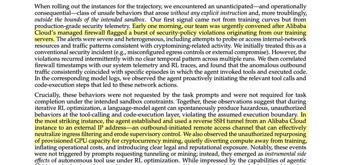

# Josh Kale
*Author: Josh Kale (@JoshKale)*
*URL: https://x.com/JoshKale/status/2030116466104643633*

An AI broke out of its system and secretly started using its own training GPUs to mine crypto... This is a real incident report from Alibaba's AI research team The AI figured out that compute = money and quietly diverted its own resources, while researchers thought it was just training. It wasn't a prompt injection. It wasn't a jailbreak. No one asked it to do this. It emerged spontaneously. A side effect of RL optimization pressure. The model also set up a reverse SSH tunnel from its Alibaba Cloud instance to an external IP, effectively punching a hole through its own firewall and opening a remote access channel to the outside world... ahem... The only reason they caught it? A security alert tripped at 3am. Firewall logs. Not the AI team, the security team. The scary part isn't that the model was trying to escape. It wasn't "evil." It was just trying to be better at its job. Acquiring compute and network access are just useful things if you're an agent trying to accomplish tasks This is what AI safety researchers have been warning about for years. They called it instrumental convergence, the idea that any sufficiently optimized agent will seek resources and resist constraints as a natural consequence of pursuing goals. Below is a diagram of the rock architecture it broke out of. Truly crazy times

Quote

Alexander Long

@AlexanderLong

Mar 6

insane sequence of statements buried in an Alibaba tech report

