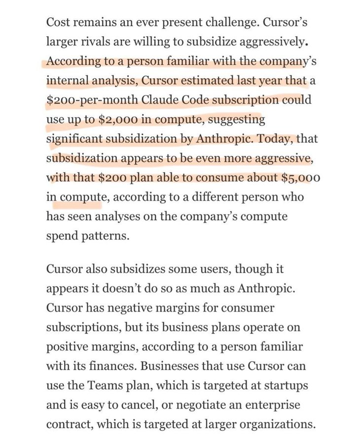

# Karan
*作者：Karan (@karankendre)*
*链接：https://x.com/karankendre/status/2030383016762372239*

Cursor 的 $200/月 实际上让他们成本 ~$5,000  
> 筹集 VC 资金  
> 烧掉它补贴你的使用  
> 让开发者沉迷于 AI 编码  
> 然后有一天也许他们会收取实际成本  
你现在不是客户。你是一个正在被引入依赖的用户。$200 的价格标签是暂时的。他们在你身上培养的习惯是永久的。

引用

dhruv

@dhruvmakes

Mar 7

Cursor 的内部分析刚刚泄露。他们 $200/月 的 Claude Code 计划……实际上让他们在计算成本上花费 ~$5,000。去年是 ~$2,000。这玩意儿真的可持续吗，还是我们会忘记怎么编码，然后 AI 也变得超级昂贵

所引用的 $200/月 计划属于 Anthropic，而不是 Cursor。Cursor 进行了分析，但 ~$4800/月/用户 的损失是 Anthropic 的。请参阅引用帖子中的截图：[x.com/dhruvmakes/sta…](https://t.co/bIoOVHh1Zn)