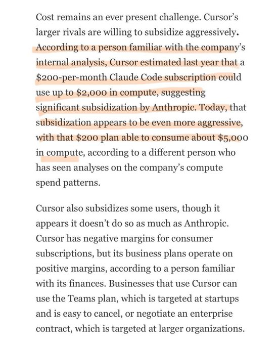

# dhruv
*Author: dhruv (@dhruvmakes)*
*URL: https://x.com/dhruvmakes/status/2030368041096352092/photo/1*
dhruv on X: "Cursor’s internal analysis just leaked. Their $200/month Claude Code plan… actually costs them ~$5,000 in compute. Last year it was ~$2,000. Is this shit really sustainable or we are gonna forgot how to code and then AI also gets mad expensive https://t.co/8ZUS9II3Pz" / X

Don’t miss what’s happening

Cursor’s internal analysis just leaked. Their $200/month Claude Code plan… actually costs them ~$5,000 in compute. Last year it was ~$2,000. Is this shit really sustainable or we are gonna forgot how to code and then AI also gets mad expensive

·

---------

What’s happening
----------------

Strnad

James Conner

Trending in United States

#InternationalWomensDay

#T20WorldCup2026final

[Show more](https://x.com/explore/tabs/for-you)

|

|

[Cookie Policy](https://support.x.com/articles/20170514)

|

[Accessibility](https://help.x.com/resources/accessibility)

|

[Ads info](https://business.x.com/en/help/troubleshooting/how-twitter-ads-work.html?ref=web-twc-ao-gbl-adsinfo&utm_source=twc&utm_medium=web&utm_campaign=ao&utm_content=adsinfo)

|

More

© 2026 X Corp.