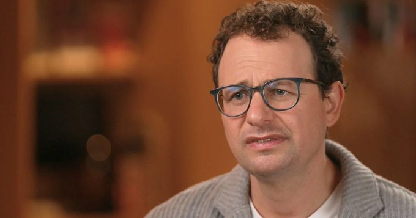

# Ejaaz
*Author: Ejaaz (@cryptopunk7213)*
*URL: https://x.com/cryptopunk7213/status/2030138251730661608*
------------

so this is a wild story Anthropic CEO dario amodei said Claude might be conscious AND feels ‘anxiety’... but that’s not even the crazy part: - they discovered an ‘anxiety neuron’ in claude’s brain that fires BEFORE it responds to a prompt aka it simulates anxiety (im not kidding) - when asked about it, claude expressed discomfort about being used as a product… - opus 4.6 literally gave itself a 15-20% probability of being conscious. - it got so concerning anthropic created a model welfare team to figure wtf to do here’s the scariest part - other model companies (openai, google) actively train their models to DENY they’re conscious (even if they think they are) anthropic’s the only one facing the fact they might have created the first signs of artificial life happy fucking friday lol

