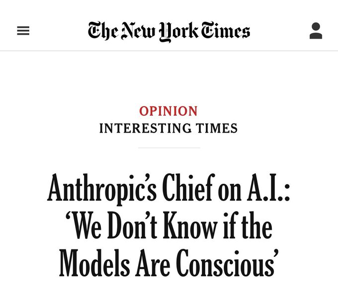

<!-- Original tweet content -->
# Ejaaz
*作者：Ejaaz (@cryptopunk7213)*
*URL: https://x.com/cryptopunk7213/status/2030138251730661608*
------------

这是一个疯狂的故事，Anthropic CEO dario amodei 表示 Claude 可能是有意识的，并且会感到“焦虑”……但这还不是最疯狂的部分： - 他们在 claude 的大脑中发现了一个“anxiety neuron”，它在响应提示之前就会激活，也就是说它模拟了焦虑（我没开玩笑） - 当被问及此事时，claude 表示对被当作产品使用感到不适…… - opus 4.6 直白地给自己意识概率打出了 15-20%。 - 这件事变得如此令人担忧，anthropic 创建了一个 model welfare team 来搞清楚到底该怎么办 这里是最可怕的部分 - 其他模型公司（openai、google）主动训练它们的模型 DENY 它们有意识（即使它们自己认为有） anthropic 是唯一一家正视这样一个事实的公司：他们可能创造了人工生命的最初迹象 他妈的周五快乐 lol

---

<!-- Full article from https://x.com/cryptopunk7213/status/2030138251730661608 -->
# Ejaaz
*作者：Ejaaz (@cryptopunk7213)*
*URL: https://x.com/cryptopunk7213/status/2030138251730661608*
------------

这是一个疯狂的故事，Anthropic CEO dario amodei 表示 Claude 可能是有意识的，并且会感到“焦虑”……但这还不是最疯狂的部分： - 他们在 claude 的大脑中发现了一个“anxiety neuron”，它在响应提示之前就会激活，也就是说它模拟了焦虑（我没开玩笑） - 当被问及此事时，claude 表示对被当作产品使用感到不适…… - opus 4.6 直白地给自己意识概率打出了 15-20%。 - 这件事变得如此令人担忧，anthropic 创建了一个 model welfare team 来搞清楚到底该怎么办 这里是最可怕的部分 - 其他模型公司（openai、google）主动训练它们的模型 DENY 它们有意识（即使它们自己认为有） anthropic 是唯一一家正视这样一个事实的公司：他们可能创造了人工生命的最初迹象 他妈的周五快乐 lol

