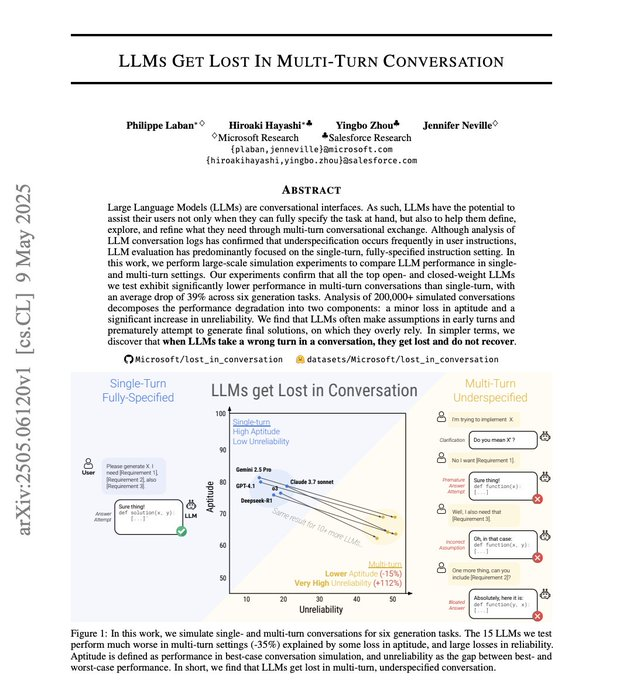

# Oliver Prompts
*Author: Oliver Prompts (@oliviscusAI)*
*URL: https://x.com/oliviscusAI/status/2030237913724645449*
------------

Microsoft Research + Salesforce just dropped a paper that should scare every single AI builder right now. They tested 15 of the top models (GPT-4.1, Gemini 2.5 Pro, Claude 3.7 Sonnet, o3, DeepSeek R1, Llama 4) across 200,000+ simulated conversations. The results are actually terrifying. If you give a model a single-turn prompt, it hits 90% performance. But if you have a multi-turn conversation? it plummets to 65%. same model. same task. just.. talking normally. The crazy part is that the ai isn't getting dumber (aptitude only dropped 15%). the problem is that unreliability EXPLODED by 112%.. Here is exactly why they break: → they answer before you finish explaining, and those wrong assumptions get baked in permanently → they fall in love with their first wrong answer and just keep building on it → they completely forget the middle of your conversation → longer responses introduce more assumptions, which means more errors Even the new reasoning models failed. o3 and deepseek r1 performed just as badly. giving them extra "thinking tokens" did absolutely nothing. setting temperature to 0? still broken. Every benchmark we celebrate is tested in perfect, single-prompt lab conditions. but real conversations break every model on the market and nobody is talking about it.. The only fix right now? stop chatting. Give your AI everything upfront in one massive message instead of going back-and-forth.

Readers added context they thought people might want to know

Context is written by people who use X, and appears when rated helpful by others. [Find out more](https://x.com/i/flow/join-birdwatch).