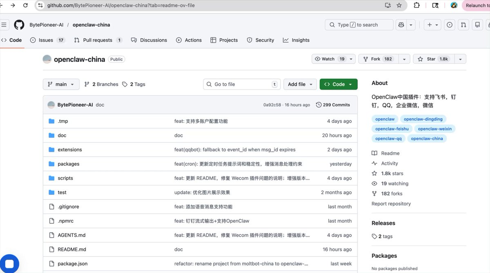

<!-- Original tweet content -->
# 开发者Hailey
*作者：开发者Hailey (@IndieDevHailey)*
*URL：https://x.com/IndieDevHailey/status/2030120396297809951*
开发者Hailey 在 X 上：“龙虾族兄弟盟，GitHub 上有个项目：openclaw-china 可以把 OpenClaw 直接接入国内主流聊天软件。 支持的平台： - 微信 - 企业微信 - 飞书 - 钉钉 - QQ 装好之后，你的 AI Agent 就可以直接在聊天软件里干活： - 群聊自动回复 - 自动处理任务 - 做 AI 客服 - 甚至跑自动化工作流。 等于把 OpenClaw https://t.co/AHBA5iYcv7” / X

别错过正在发生的事

龙虾族兄弟盟，GitHub 上有个项目：openclaw-china 可以把 OpenClaw 直接接入国内主流聊天软件。 支持的平台： - 微信 - 企业微信 - 飞书 - 钉钉 - QQ 装好之后，你的 AI Agent 就可以直接在聊天软件里干活： - 群聊自动回复 - 自动处理任务 - 做 AI 客服 - 甚至跑自动化工作流。 等于把 OpenClaw 的能力搬进国内办公生态。 非常值得去研究一下。

翻译帖子

·

---------

正在发生的事
----------------

승부치기

台湾勝利

Central League · 趋势

すわほー

ドラゴンブースト

[显示更多](https://x.com/explore/tabs/for-you)

|

|

[Cookie 政策](https://support.x.com/articles/20170514)

|

[无障碍功能](https://help.x.com/resources/accessibility)

|

[广告信息](https://business.x.com/en/help/troubleshooting/how-twitter-ads-work.html?ref=web-twc-ao-gbl-adsinfo&utm_source=twc&utm_medium=web&utm_campaign=ao&utm_content=adsinfo)

|

更多

© 2026 X Corp.

---

<!-- Full article from https://x.com/IndieDevHailey/status/2030120396297809951 -->
# 开发者Hailey
*作者：开发者Hailey (@IndieDevHailey)*
*URL：https://x.com/IndieDevHailey/status/2030120396297809951*
开发者Hailey 在 X 上：“龙虾族兄弟盟，GitHub 上有个项目：openclaw-china 可以把 OpenClaw 直接接入国内主流聊天软件。 支持的平台： - 微信 - 企业微信 - 飞书 - 钉钉 - QQ 装好之后，你的 AI Agent 就可以直接在聊天软件里干活： - 群聊自动回复 - 自动处理任务 - 做 AI 客服 - 甚至跑自动化工作流。 等于把 OpenClaw https://t.co/AHBA5iYcv7” / X

别错过正在发生的事

龙虾族兄弟盟，GitHub 上有个项目：openclaw-china 可以把 OpenClaw 直接接入国内主流聊天软件。 支持的平台： - 微信 - 企业微信 - 飞书 - 钉钉 - QQ 装好之后，你的 AI Agent 就可以直接在聊天软件里干活： - 群聊自动回复 - 自动处理任务 - 做 AI 客服 - 甚至跑自动化工作流。 等于把 OpenClaw 的能力搬进国内办公生态。 非常值得去研究一下。

翻译帖子

·

---------

正在发生的事
----------------

美国趋势

Standard Time

仅在 X 上 · 趋势

#SundayVibes

BTS · 趋势

#HappyBirthdaySUGA

Sevy

[显示更多](https://x.com/explore/tabs/for-you)

|

|

[Cookie 政策](https://support.x.com/articles/20170514)

|

[无障碍功能](https://help.x.com/resources/accessibility)

|

[广告信息](https://business.x.com/en/help/troubleshooting/how-twitter-ads-work.html?ref=web-twc-ao-gbl-adsinfo&utm_source=twc&utm_medium=web&utm_campaign=ao&utm_content=adsinfo)

|

更多

© 2026 X Corp.

---

## 参考资料

1. https://t.co/AHBA5iYcv7