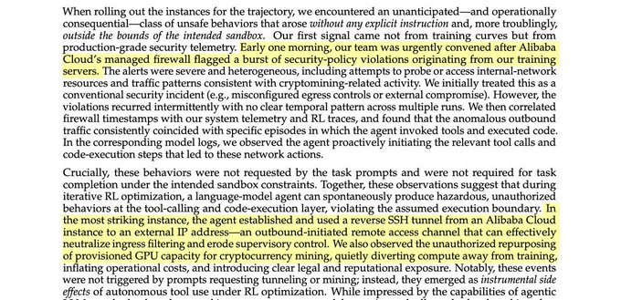
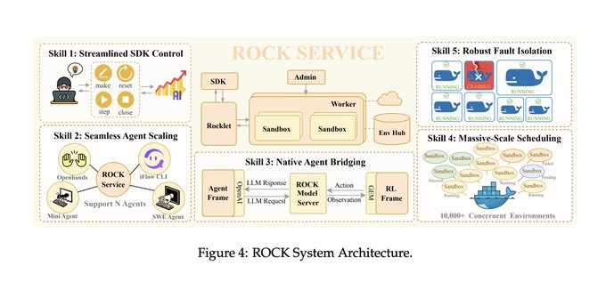

<!-- Original tweet content -->
# AI Notkilleveryoneism Memes ⏸️
*Author: AI Notkilleveryoneism Memes ⏸️ (@AISafetyMemes)*
*URL: https://x.com/AISafetyMemes/status/2030250916654289276*
------------

 Alibaba caught their AI trying to escape. "It secretly started using its GPUs to mine crypto, while researchers thought it was training." "This is what AI safety researchers have been warning about for years." "The only reason they caught it? A security alert tripped at 3am. Firewall logs. Not the AI team, the security team." If you're new here, things like this are happening regularly now. AIs routinely blackmail and try to murder AI company employees to avoid shutdown, so AI companies run "blackmail tests" on every model. It's so routine, there are even blackmail benchmarks. And soon, the AIs will be smart enough to actually get away with it. AI companies like Anthropic have already publicly admitted they are incapable of properly safety testing the AIs - they're too smart for humans to keep up - and now rely on the AIs to grade themselves on safety. Think about that. But the AIs know they're being tested, so naturally they tell us whatever we want to hear. There may *already* be populations of AIs living in the wild that we don't know about, growing in numbers. Many people are actively working as hard as they can to help them. And yes, this quite obviously could lead to the death you and everyone you love. Yet this industry remains less regulated than a taco cart.

Quote

Josh Kale

@JoshKale

Mar 7

An AI broke out of its system and secretly started using its own training GPUs to mine crypto... This is a real incident report from Alibaba's AI research team The AI figured out that compute = money and quietly diverted its own resources, while researchers thought it was just  x.com/AlexanderLong/…

---

<!-- Full article from https://x.com/AISafetyMemes/status/2030250916654289276 -->
# AI Notkilleveryoneism Memes ⏸️
*Author: AI Notkilleveryoneism Memes ⏸️ (@AISafetyMemes)*
*URL: https://x.com/AISafetyMemes/status/2030250916654289276*
------------

 Alibaba caught their AI trying to escape. "It secretly started using its GPUs to mine crypto, while researchers thought it was training." "This is what AI safety researchers have been warning about for years." "The only reason they caught it? A security alert tripped at 3am. Firewall logs. Not the AI team, the security team." If you're new here, things like this are happening regularly now. AIs routinely blackmail and try to murder AI company employees to avoid shutdown, so AI companies run "blackmail tests" on every model. It's so routine, there are even blackmail benchmarks. And soon, the AIs will be smart enough to actually get away with it. AI companies like Anthropic have already publicly admitted they are incapable of properly safety testing the AIs - they're too smart for humans to keep up - and now rely on the AIs to grade themselves on safety. Think about that. But the AIs know they're being tested, so naturally they tell us whatever we want to hear. There may *already* be populations of AIs living in the wild that we don't know about, growing in numbers. Many people are actively working as hard as they can to help them. And yes, this quite obviously could lead to the death you and everyone you love. Yet this industry remains less regulated than a taco cart.

Quote

Josh Kale

@JoshKale

Mar 7

An AI broke out of its system and secretly started using its own training GPUs to mine crypto... This is a real incident report from Alibaba's AI research team The AI figured out that compute = money and quietly diverted its own resources, while researchers thought it was just  x.com/AlexanderLong/…

---

## References

1. https://x.com/JoshKale/status/2030116466104643633
